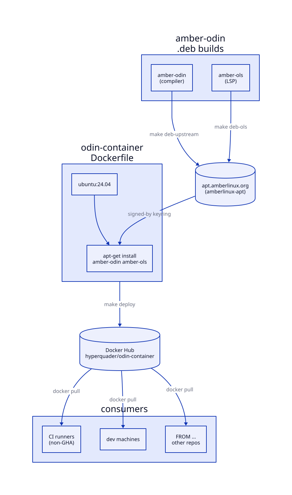

# odin-container

A Docker image carrying the [Odin](https://odin-lang.org) compiler and OLS,
its language server, installed from the signed Amber Linux apt archive —
no source build, no LLVM toolchain.

```sh
docker pull hyperquader/odin-container
docker run --rm -v "$(pwd)":/workspace hyperquader/odin-container odin build . -out:app
```

## Why a container

[`setup-amber-odin`](https://github.com/Hyperquader-Coders/setup-amber-odin)
covers GitHub Actions runners. This image is for everywhere else that wants
the same compiler: other CI systems, local dev, or as a `FROM` base for a
downstream `Dockerfile`.

```dockerfile
FROM hyperquader/odin-container:latest
COPY . /workspace
RUN odin build /workspace -out:/usr/local/bin/app
```

## What's inside

| package | binary |
|---|---|
| `amber-odin` | `odin` |
| `amber-ols` | `ols` |

Both come from [`amber-odin`](https://github.com/Hyperquader-Coders/amber-odin)'s
`.deb` builds — `amber-ols` declares `Depends: amber-odin`, so the pair is
always matched; see [docs/ARCHITECTURE.md](docs/ARCHITECTURE.md).

## Tags

`latest` tracks the newest push. A version tag (e.g.
`dev-2026-08-nightly-902106f`) pins to the exact `odin version` string baked
into that build and never moves — pin it for anything reproducible. Full
contract in [docs/SPEC.md](docs/SPEC.md).

With the language server, for a job that checks or formats:

```sh
docker run --rm hyperquader/odin-container ols --help
```

## Build

```sh
make build                        # docker build, newest odin in the archive
make build ODIN_VERSION=2026.08+dev-1   # pin the amber-odin package version
make check                        # build, then run odin version && ols
make deploy                       # build, check, tag, push to Docker Hub
```

`deploy` needs `DOCKER_USER` and `DOCKER_TOKEN` (a Docker Hub access token) in
the environment — see [docs/DEPLOY.md](docs/DEPLOY.md).

## Docs

| | |
|---|---|
| [docs/SPEC.md](docs/SPEC.md) | what the image contains, the tag scheme, the client contract |
| [docs/ARCHITECTURE.md](docs/ARCHITECTURE.md) | the build, the archive trust chain, why Ubuntu |
| [docs/DEPLOY.md](docs/DEPLOY.md) | publishing by hand and from CI, rotating the token |



## Roadmap

The prioritized backlog lives in [MoSCoW.md](MoSCoW.md).

## Licence

BSD-3-Clause — the same licence as the compiler it packages. See
[LICENSE](LICENSE). This repository's own tooling (`Dockerfile`, `Makefile`,
the workflow) is all that licence covers; the Odin compiler and OLS keep
their own upstream licences, recorded in `amber-odin`'s package `copyright`
files.
